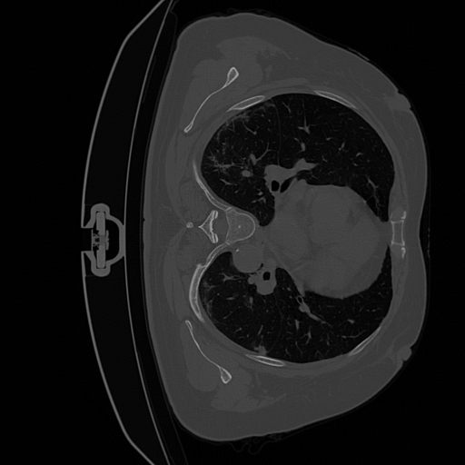
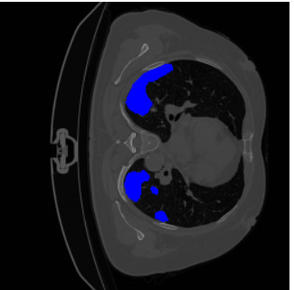
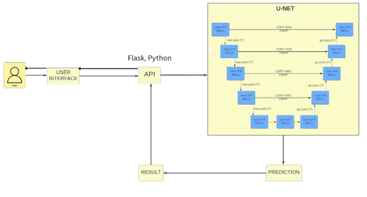
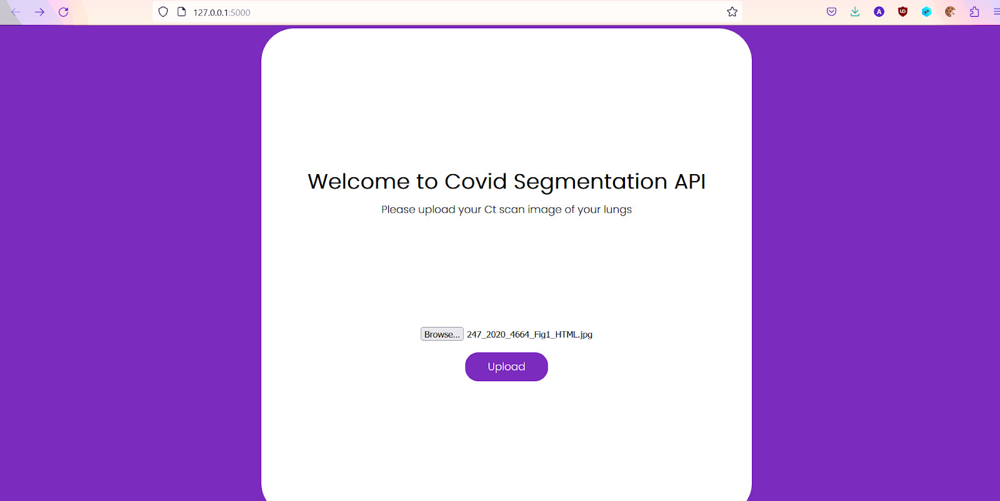
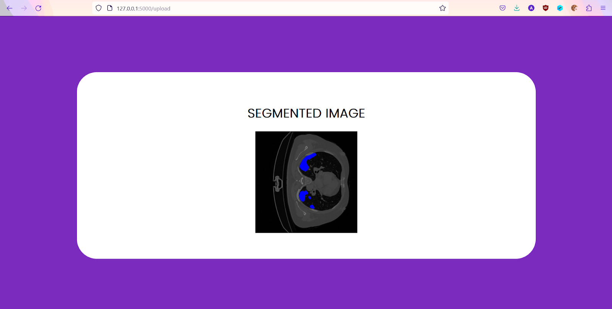

# COVID-19 Detection Using U-Net

This project implements a **U-Net model** for detecting COVID-19 infections in lung CT scans through image segmentation. The goal is to provide accurate and reliable detection of infected areas, aiding in early diagnosis.

## Project Overview

- **Objective**: To segment and detect COVID-19 infected regions in lung CT images using a U-Net architecture.
- **Model**: U-Net, a deep learning architecture designed for image segmentation, especially useful in medical imaging tasks.
- **Approach**: The app processes CT scan images and produces segmentation masks that highlight infected areas.

## Key Features

- **Deep Learning for Medical Imaging**: Utilizes the U-Net model to achieve precise segmentation of infected lung regions.
- **Image Segmentation**: Automatically generates infection masks from CT scans.
- **Performance Metrics**: Implements Dice Coefficient and IoU for model evaluation and accuracy measurement.

## Technology Stack

- **Python**: The project is implemented in Python using machine learning libraries.
- **TensorFlow / Keras**: Used for building and training the U-Net model.
- **OpenCV & NumPy**: For image preprocessing and data handling.

## Images
**Model Input**



**Model Output**



**Architecture**



**Interface**





## Installation

1. Clone the repository:
   ```bash
   git clone https://github.com/jazzirHussain/covid_detection_UNET.git
   cd covid_detection_UNET
